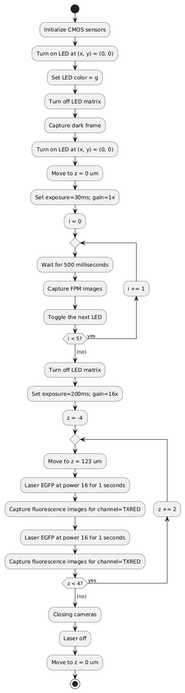
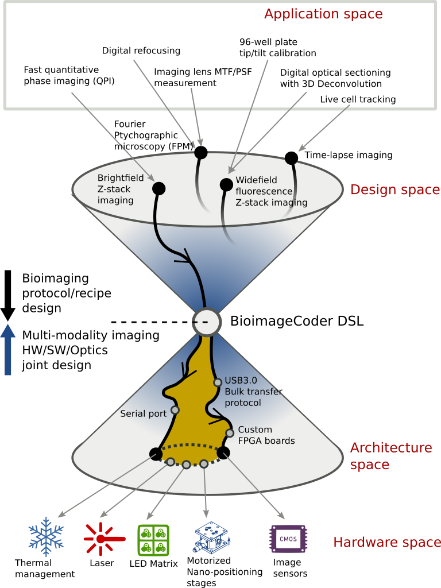
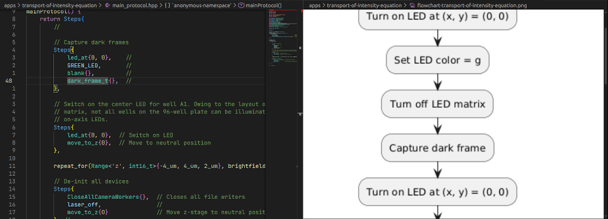
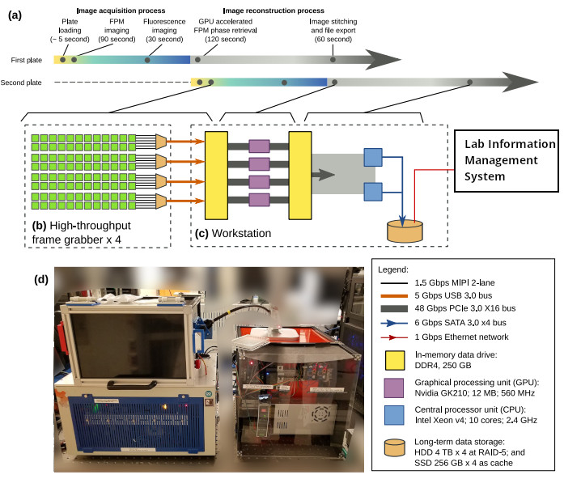

# Bioimage Coder for Caltech/Amgen 96-camera parallel imaging system

**Bioimage Coder** is a domain-specific language (DSL) and workbench for
describing **bioimage capture protocols** in an expert-readable,
hardware-agnostic form. It is designed to sit at the *waist* of the hourglass
architecture: separating **what** the experiment does (the protocol / recipe)
from **how** it is executed (instrument hardware, firmware, and drivers).

This repository explores how a carefully designed DSL can preserve experimental
intent across multi‑modal imaging workflows while enabling aggressive,
platform‑specific optimization underneath.

Example code:

```c++
constexpr auto
mainProtocol() {
    return Steps{
        // Capture dark frames
        Steps{
            led_at{0, 0},    //
            GREEN_LED,       //
            blank{},         //
            dark_frame_t{},  //
            led_at{0, 0},    // Switch on LED
            move_to_z{0_um},    // Move to neutral position
        },

        // Capture ptychography images
        repeat_for(Range<'i', uint8_t>{0, 5}, fpmImagingProtocol),  //

        Steps{
            blank{},  // Turn off LED.
        },

        // Capture fluorescence z-stack images
        repeat_for(Range<'z', int16_t>{-4_um, 4_um, 2_um}, fluorescenceImagingProtocol),  //

        // De-initialize all hardware components
        Steps{
            CloseAllCameraWorkers{},  // Closes all file writers
            laser_off,                //
            move_to_z{0_um}              // Move z-stage to neutral position
        }  //
    };
}
```

And the corresponding flowchart:



## Status

This repository is one of the following components of the 96-Eyes instrument design project:

- (this repository) 96-Eyes instrument control code for concurrent, asynchronous
  camera capture and disk I/O;

- (to be released) Alternate instrument control code via `MPI for Python` and `Parallel HDF5`;

- [96-Eyes Ptychographic reconstruction algorithm and file decoder](https://github.com/Caltech-Biophotonics-Lab/fpm-96eyes-reconstruction);

- GPU-accelerated, Zernike-guided lens aberration recovery (FPM-EPRY) algorithm for brightfield-only FPM images, and graphical user interfaces;

- Electronic circuit design and circuit board drawing of the illumination, thermal, and incubation modules;

This repository is currently in code freeze status; new feature will not be
developed here. However, we do occasionally patch the code to track the latest
CPU/GPU hardware changes, especially those hosted on the build validation
server. We also accept pull requests and bug reports.

## Motivation: the Hourglass Model for Bioimaging

The two branches of R&D: system engineering and system integration, is prone to
impedance mismatch due to different pace of workload over the span of the
project.

*De novo*, high‑throughput bioimaging systems evolve rapidly over the course of
the project: optics, sensors, illumination, motion stages, and firmware
pipelines are redesigned over successive iterations to improve speed and signal
quality over the project lifetime. The pace of system engineering tapers to a
near halt through a sequence of "design lockdowns" near the product launch phase.

In contrast, **image capture protocols** -- the ordered sequence of excitation,
exposure, motion, and acquisition steps -- encode *scientific intent* and
changes much more slowly. Protocol revision activities conducted by system
integration teams, e.g. post-design-lockdown synchronization tweaks and
performance mitigations, only ramps up when the project is close to product
launch.

This asymmetry naturally forms an **hourglass model**:

* **Top-down (Wide):** Diverse experimental protocols (time‑lapse, Z‑stacks, multi‑channel fluorescence, mixed modalities)
* **Middle (Narrow):** A stable, precise, domain-expert‑readable DSL describing the protocol
* **Bottom-up (Wide):** Diverse hardware and firmware implementations optimized for specific instruments



By *narrowing the waist* of the hourglass with a DSL, protocol design process
shares a common design language decoupled from the underlying hardware design.
The two design processes remains orthogonal, and do not block each other's
project roadmap. In other words, system architects can independently evolve
imaging platforms while preserving protocol correctness, readability, and reuse.

This bioimaging proctocol idea mirrors similar separations in:

* Next‑generation sequencing, commonly known as sequencing "assays/recipes";
* Mobile imaging pipelines, commonly known as "use‑cases", e.g. MFSR, HDR, or Bokeh mode;
* Compiler design, commonly known as the intermediate representations (IR),
  decoupling the coding language syntax from the architecture-specific machine
  code generation backends.

## Design Goals

Bioimage Coder is guided by the following principles:

1. **Expert‑readable first**
   Protocols must remain readable and reviewable by domain experts, especially system integration scientists and computational imaging experts, not just software developers.

2. **Hardware decoupling**
   Protocol descriptions are independent of camera models, illumination controllers, and motion stages.

3. **Multi‑modality preservation**
   The DSL explicitly encodes modality changes, e.g. widefield fluorescence, ptychographic imaging, time-lapse tracking, instead of flattening them into opaque command streams of illumination / exposure / motion / thermal /  fluorescent excitation commands.

4. **Zero-cost abstraction**
   Execution models must support high‑throughput imaging, i.e. to avoid the PCIe bus having to wait for the runtime command interpreter to stream pixels.

5. **Visualization as a first‑class tool**
   Protocol document should be visible as a concise SOP (standard operating procedure) document with flowcharts while editing at the office, not inferred by monitoring the log messages during instrument run in the lab.

## The Bioimage Coder DSL

The syntax is inspired by
[**BioCoder**](https://doi.org/10.1186/1754-1611-4-13), a domain-specific
language originally designed for wet‑lab biological procedures, as well as
[automated microfluidic device tape in / tape out](https://doi.org/10.1109/BioCAS.2013.6679649). Bioimage Coder adapts this idea
to **instrument control**, focusing on deterministic sequencing, timing, and
modality transitions.

At its core, the DSL:

* Describes *what happens* in an imaging experiment
* Avoids embedding *how it is implemented* on a specific platform
* Acts as a stable intermediate representation for code generation

The DSL is intended to be compiled or lowered into platform‑specific execution plans, rather than interpreted at runtime.

## The Bioimage Coder Workbench

Beyond the language itself, this project envisions a **Bioimage Coder workbench**, following Martin Fowler’s definition of a *language workbench*:

* Live editing of protocol definitions
* Immediate structural validation
* **Real‑time visualization** of protocol flow



A key feature is **PlantUML‑based flowchart rendering**, generated directly from the DSL. As the protocol is edited, the visualization updates in real time, allowing scientists and integrators to:

* Inspect ordering and branching
* Validate timing‑critical sequences
* Communicate protocol intent across disciplines

This tight feedback loop is critical in complex, high‑throughput systems where subtle ordering mistakes can lead to photobleaching, camera buffer loss, or reduced signal quality.

Check out various bio-imaging protocols and the generated flowcharts:

- `apps/amgen-2019-full/`: The default plate imaging mode for joint fluorescence and quantitative phase image co-registration;
- `apps/transport-of-intensity-equation/`: An auxiliary mode for low-resolution, time-lapse live cell tracking applications; also used for well plate curvature studies;
- `apps/lucy-richardson-deconvolution/`: Computational optical sectioning of stained live cells, e.g. via Lucy-Richardson algorithm or ADMM.

## Frequently asked questions

### Why C++17 Instead of Python?

While Python dominates scientific computing, **instrument control at extreme throughput** has different constraints.

Bioimage Coder uses **C++17** to:

* Eliminate dynamic dispatch and interpreter overhead
* Enable compile‑time scheduling and static optimization
* Guarantee deterministic execution latency

In high‑throughput imaging, command dispatch overhead directly reduces
achievable frame rate and increases [**illumination
overhead**](https://doi.org/10.1242/jcs.242834): cell samples exposed to
excitation light without contributing useful signal to cameras on standby. This
overhead accelerates photobleaching and degrades data quality. Compiling
protocols into native code minimizes idle illumination and maximizes usable
throughput, which is critical for large-scale, multi-well imaging.

That said, the earliest proof of concept (POC) solution was implemented in
*Python as the glue language* around C/C++ optimized components:
- [MPIPy](https://mpi4py.readthedocs.io/en/stable/) for multi-process parallelism;
- [H5Py](https://docs.h5py.org/en/stable/), [HDF5-MPIO](https://wordpress.cels.anl.gov/romio/) as the high-throughput, non-blocking image file I/O; and
- [Sqlite3](https://sqlite.org/) for well plate metadata and image quality database management.

The POC code will be released separately.

### Why not C++20 Concepts?

It is primarily because the 96-Eyes project concluded in late 2019. At the time,
C++17 (with `<type_traits>` and folded expressions) were already the bleeding
edge. We welcome pull requests (PRs) to modernize the code generation pipeline
with C++20 Concepts syntax.

### Why the z-position parameters, exposure time, etc are hardcoded values?

The 96-Eyes instrument is a *de novo* computational imaging platform: it
captures data first and ask questions later. To reflect this design, the
BioImage Coder's DSL encodes the imaging parameters as **compile-time constants**.
This is in alignment with the hourglass model: bioimaging protocol design and
bioimaging platform design are strictly orthogonal, and should remain such by
meeting at the middle with a constrained DSL.

For example, widefield fluorescence z-stack imaging of all 96 wells completes in
2~5 minutes per plate. Extending the z-range compensates for [residual plate
curvature and tip-tilt](https://arxiv.org/abs/2406.15621). Autofocus is
performed computationally off-instrument after acquisition, freeing up the
instrument for the next well plate.

Hardcoded values presents an advantage over runtime interpretation thanks to
**compile-time analysis** of the imaging conditions. The DSL, as a
machine-readable document, can reason about the photon budgets ahead of the
execution. The compiler can **rewrite the protocol** with domain-expert
knowledge, e.g. priortizing illumination intensity over exposure time, and
exposure over camera's analog gain, to minimize end-to-end noise generation
before the images are collected from the instrument.

### Why Boost::Fiber on a single CPU thread?

Earlier proof of concept solution built with non-blocking multi-process
parallelism with [MPIPy](https://mpi4py.readthedocs.io/en/stable/) and
[HDF5-MPIO](https://wordpress.cels.anl.gov/romio/) showed that throughput
bottleneck occurred either in the `libusb` kernel driver servicing synchronous
bulk transfer syscalls, or at the hardware multiplexer (i.e. single xHCI)
connecting the 4 USB3.0 ports and the PCIe bus. Asynchronous USB data transfer
was not available from the vendor till the near end of the project.

Experiments with modified userspace USB packet sizes (adopting TCP-style
congestion control algorithm) revealed that single-threaded, cooperative
scheduling architecture best matches the instrument's behavior.
[Boost.Fiber](https://www.boost.org/doc/libs/latest/libs/fiber/doc/html/fiber/overview.html)
provides this programming model with low overhead and precise control.

Speaking of which, a distributed compute architecture is possible for the
96-Eyes project, having one frame grabber per motherboard in a small compute
cluster with 10Gbps Ethernet interconnect. An MPI-style multi-process
parallelism would make sense in this case.

### The design of the raw frame header looks unusual, what's the "light-bulb" moment?

You are likely referring to the ["countdown sequence" in the raw USB binary
packet](https://github.com/antonysigma/bioimage-coder/blob/main/message_router/inc/frame-capture-card-impl.hpp#L55-L58).
This mechanism predates my direct involvement in the project.
Please consult Dr Jinho Kim's PhD thesis for details.

Conceptually, the design mirrors well known synchronization patterns, such as
[Clock synchronization signal over FM
radio](https://en.wikipedia.org/wiki/Greenwich_Time_Signal), cinematic
countdown, or maybe inspired by the CRISPR-Cas9's target gene matching and cleaving
mechanism.

### Where can I buy the frame grabber?

Please contact the corresponding author of the [Scientific Report article](http://dx.doi.org/10.1038/s41598-019-47146-z) regarding the FPGA-boards of the 96-Eyes platform.

### Where is the 96-Eyes instrument? Can I borrow one?

The project concluded in late 2019. The instrument was delivered and installed at the Lead Discovery Group of Amgen SSF division.
To the best of my knowledge, it has since been safely preserved.

As with many large-scale research instruments, its future deployment depends on
ever-shifting drug discovery landscapes. At the time of writing, the industry is
transitioning from batch-optimized, molecule-centric assays/protocols toward
spatial biology-driven, single-cell approaches. I am grateful to have
contributed to this multi-year, multi-PI initiative, and remain hopeful for the
renewed industrial interest in computational bio-photonics and imaging
technology.

### I noticed the CMOS sensor initialization sequence is expressed as raw MIPI/I²C commands. Can I obtain a copy?

Exposing CMOS sensor initialization at the raw MIPI/I2C commands is uncommon in
bio-microscopy, partly because instrument R&D labs often rely on retail camera
modules and vendor-supplied drivers to achieve time/cost efficiency. In
contrast, large-scale consumer-oriented imaging platforms have demonstrated that
[sensor bring-up can be safely handled in
userspace](https://libcamera.org/introduction.html), provided the operating
system and driver model are designed to support it.

In practice, sensor initialization sequences are frequently covered by OEM
confidentiality agreements, regardless of academic fields and/or industry
sectors. Revealing the raw sensor bring-up sequence effectively discloses the
sensor foundry's manufacturing capabilities. As a result, popular maker-oriented
camera solutions [ship closed or partially obfuscated
drivers](https://www.raspberrypi.com/documentation/computers/camera_software.html)
that encapsulate these sequences, typically as monolithic kernel module
binaries.

For the 96-Eyes project, the emphasis on raw throughput and fine-grained timing
control motivated a different integration approach. As part of an
industry–academia collaboration, the Caltech team worked directly with imaging
and FPGA partners under mutual NDAs to obtain the necessary level of document
access. This, in turn, enabled the deep integration of the sensor bring-up
sequence into the BioImage Coder DSL.

This approach worked because of the project's specific goals and an unusually
high level of trust between the academic lab and industry partners. In my
experience, replicating the success in typical foundry-vendor-instrument
three-party relationships would be challenging.

## Appendix: Caltech 96‑Well High‑Throughput Imaging Platform

Bioimage Coder is tailor-made to support the **Caltech 96‑well imaging
platform**, a high‑throughput system capable of rapid, multi‑modal acquisition
across all wells on the 96-well plate.

The platform architecture demonstrates how careful joint‑design of optics,
mechanics, firmware, algorithm, and software can achieve exceptionally high
imaging throughput. Published results already quantified the achieved frame
rates and system‑level performance characteristics.

Bioimage Coder complements this work by providing a *protocol‑level abstraction*
that preserves experimental intent while allowing the underlying system to
operate at peak efficiency.



## License

See the repository for license information.

## References

### BioCoder publications

- Ananthanarayanan V, Thies W. Biocoder: A programming language for
  standardizing and automating biology protocols. J Biol Eng. 2010 Nov 8;4:13.
  doi: [10.1186/1754-1611-4-13](https://doi.org/10.1186/1754-1611-4-13). PMID:
  21059251; PMCID: PMC2989930.

- J. McDaniel, C. Curtis and P. Brisk, "Automatic synthesis of microfluidic
  large scale integration chips from a domain-specific language," 2013 IEEE
  Biomedical Circuits and Systems Conference (BioCAS), Rotterdam, Netherlands,
  2013, pp. 101-104, doi:
  [10.1109/BioCAS.2013.6679649](https://doi.org/10.1109/BioCAS.2013.6679649).

### The hourglass architecture

- E. Lee, S. Neuendorffer, M.J. Wirthlin, "Actor oriented design of embedded
  hardware and software systems", Invited paper, Journal of Circuits, systems,
  and computers, 2002.

- A. Sangiovanni-Vincentelli, F. Martin, "Platform-based design and software
  design methodology for embedded systems," IEEE Design & test of computers,
  2001.

### Caltech/Amgen 96-eyes instrument

- A.C.S. Chan, J Kim, A Pan, H Xu, D Nojima, C Hale, S Wang, C Yang, [“Parallel
  Fourier ptychographic microscopy for high-throughput screening with 96 cameras
  (96 Eyes)”](http://dx.doi.org/10.1038/s41598-019-47146-z) Scientific Reports 9, 11114 (2019).

- Y. Huang, A.C.S. Chan, A. Pan, and C. Yang, ["Memory-efficient, Global Phase-retrieval of Fourier Ptychography with Alternating Direction Method,"](https://doi.org/10.1364/COSI.2019.CTu4C.2) in Imaging and Applied Optics 2019 (COSI, IS, MATH, pcAOP), OSA Technical Digest (Optica Publishing Group, 2019), paper CTu4C.2.

### Domain-specific language design, and flowchart generation

- Martin Fowler, "Domain-specific Languages", Addison-Wesley, USA.
- Michael Caisse, “Modern C++ in Embedded Systems”, C++Now 2018. https://www.youtube.com/watch?v=c9Xt6Me3mJ4
- Kris Jusiak “BOOST.SML State Machine Language", C++Now 2017. https://www.youtube.com/watch?v=Lg3tIact5Fw

### Impact of software runtime overhead to bioimaging systems

- A. Kiepas, E. Voorand, F. Mubaid, P.M. Siegel, M. Claire ["Optimizing live-cell
  fluorescence imaging conditions to minimize phototoxicity"](https://doi.org/10.1242/jcs.242834) Journal of Cell
  Science 2020, Vol 133(4).